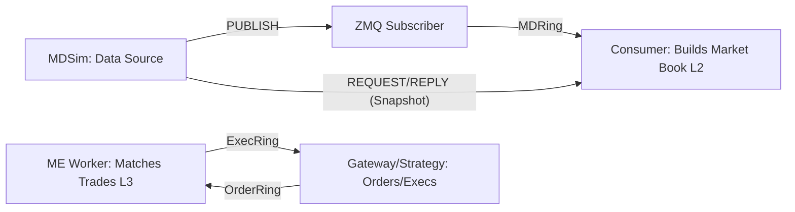

# Low-latency Order Matching Engine

This is a compact system for handling market data and trade matching. It uses and mimics the same high-performance principles you'd find in real exchanges:

* **Market Data Pipeline:** Our `mdsim` is the data source, streaming **Level 2 updates** and a consolidated **Level 1** feed over ZeroMQ. It can also serve **full snapshots** on demand.
* **The Live Book:** A dedicated **consumer** applies those L2 changes to create a live **market book**. This module is critical—it ensures **data integrity** by enforcing checks and automatically recovering from data gaps by pulling a new snapshot.
* **Trade Matching:** A separate **Level 3 (L3) engine book** handles the actual trade logic. It uses a **price-time priority** rule to execute all order types (limit, market, cancel, replace).
* **Communication:** All components communicate using **lock-free SPSC rings**—it's how we ensure fast, predictable hand-off for order commands coming in and execution reports going out.
* **Trust But Verify:** A **cross-validator** runs continuous checks, comparing our live book against the simulator's snapshot to ensure **absolute correctness**.

Using patterns like **batching, conflation, single-writer design, and ring buffers** to achieve real-world speed and reliability."

---

## 1) Quick start

### Dependencies

* **C++17**, **CMake ≥ 3.16**
* **ZeroMQ** & **cppzmq** (header-only binding)
* **GoogleTest** (vendored or via your package manager)

macOS (Homebrew):

```bash
brew install cmake zeromq cppzmq
```

Ubuntu/Debian:

```bash
sudo apt-get update
sudo apt-get install -y cmake g++ libzmq3-dev
# cppzmq (header-only)
sudo apt-get install -y nlohmann-json3-dev || true  # not required, but handy
```

### Build

```bash
cmake -S . -B build -DCMAKE_BUILD_TYPE=Release
cmake --build build -j
```

### Run the demo

**Terminal A** – Market data simulator (PUB/REP):

```bash
./build/feed/mdsim        # PUB tcp://*:6001, REP tcp://*:6002
```

**Terminal B** – Pipeline (subscriber → rings → consumer + engine + validator):

```bash
./build/app/me_pipeline   # connects to tcp://localhost:6001 and :6002
```

You should see something like:

```
[me_pipeline] running. Submitting a demo order...
[exec] oid=2001 type=0 status=0 last_qty=0 last_px=0 leaves=3 trade=no
[exec] oid=1001 type=1 status=1 last_qty=3 last_px=200181 leaves=2 trade=yes
[md_sub] snapshot ok. last_l2=2065 last_l1=2068
[health] l2_applied=1000 l1_seen=321 invariants_fail=0 idempotent=1000 levels=82 bid=200104 ask=200019
```

> Prefer one command? Use the helper script:
>
> ```bash
> ./scripts/run_demo.sh
> ```

---

## 2) What’s inside 

1.  **Market Data Ingestion:**
      * The **MDSim** (Market Data Simulator) , publishing Level 1 and Level 2 data (L1/L2) and standing by to provide full **Snapshots**.
      * The **ZMQ Subscriber** grabs this data and puts it onto a **MDRing** (Market Data Ring).
2.  **Order Book Construction:**
      * The **Consumer** takes data from the ring and builds the **Market Book**. This book holds the aggregated L2 data and includes **rigorous acceptance checks** to ensure data quality (e.g., `bestBid < bestAsk`, and automatic $\mathbf{gap \to resnapshot}$ recovery).
3.  **Trade Execution:**
      * The **Gateway/CLI or Strategy** submits orders via the **OrderRing**.
      * The **MatchingEngineWorker (MEW)** processes these orders against the **Engine Book**. This is our **L3 (price-time priority)** book, which allows for extremely fast $\mathbf{O(1)}$ cancels and replaces.
      * The MEW publishes execution results back to the Gateway through the **ExecRing**.

### Key Checks:

  * **Cross-validator:** This module ensures accuracy by $\mathbf{requesting snapshots}$ from the Sim and comparing them against our internal book to verify every detail matches."



---

## 3) Try a real trade (CLI)

The matching engine book starts empty; to force a trade, place a resting maker then a taker.

Build target: `oi_cli`
Examples:

```bash
# Resting ask @ 200100 ticks, qty 3
./build/app/oi_cli NEW --side=ASK --px=200100 --qty=3 --id=2001

# Market buy (taker)
./build/app/oi_cli NEW --side=BID --type=MARKET --qty=5 --id=1001

# Cancel by id
./build/app/oi_cli CXL --id=2001

# Replace (price move ⇒ new priority)
./build/app/oi_cli REPL --id=2001 --px=200120 --qty=4
```

You’ll see matching `[exec]` lines in the `me_pipeline` terminal.


---

## 4) Correctness & tests

We also make sure our core runtime rules & checks are enforced by turning them into **automated tests**.

To run all tests:

```bash
ctest --test-dir build -j
```

Key scenarios covered in tests:

* **L2 invariants:** `bestBid < bestAsk`, level totals ≥ 0, empty levels removed.
* **Idempotency:** replay the same L2 delta twice → state unchanged.
* **Gap→resnapshot:** consumer detects sequence gaps, pulls snapshot, then resumes.
* **Cross-validation:** compare our book vs. simulator L2 snapshot at various depths to guarantee our numbers match.

> **FYI:** The simulator has a built-in **TOB repair** that prevents it from *ever* sending a crossed book (it corrects the ask if needed). This keeps our core health metric `invariants_fail` at $\mathbf{0}$ during testing.


---


## 5) Build options (compile-time toggles)

These are set in `app/CMakeLists.txt`; tweak as needed:

```cmake
target_compile_definitions(me_pipeline PRIVATE
  TRADING_USE_ORDERBOOK_SINK=1   # apply MD into market book and print health
  TRADING_USE_REAL_ME=1          # run the real EngineBook/matching path
)
```

---

## 6) Project layout

```
app/
  src/
    me_pipeline_main.cpp        # end-to-end demo wiring
    md_record_main.cpp          # (optional) record deltas
    md_replay_main.cpp          # offline replay harness
    oi_cli.cpp                  # order-gateway CLI

engine/
  src/
    MDToOrderBookConsumer.cpp   # applies L2/L1 into OrderBook + metrics
    MatchingEngineWorker.cpp    # rings → EngineBook → exec ring
    EngineBook.cpp              # price-time matching (L3)
    OrderBook.cpp               # L2/L1 structures & snapshots

feed/
  src/MDSim.cpp                 # OU process + L2 deltas + L1 conflation + snapshots

include/trading/
  common/Types.hpp              # shared wire/domain types
  containers/SpscRing.hpp
  engine/OrderBook.hpp
  engine/EngineBook.hpp
  engine/MatchingEngineWorker.hpp
  engine/OrderFlow.hpp          # OrderRing/ExecRing messages
  feed/Wire.hpp                 # L1/L2 payloads, headers, helpers
  metrics/BookMetrics.hpp

bench/engine_bench.cpp          # microbench hooks (optional)
scripts/run_demo.sh
tests/test_l2_apply.cpp         # idempotency + invariants
```

---

## 7) Metrics (Where “health” line comes from)

* Updates Applied `l2_applied`: How many Level 2 market changes we successfully processed.
* Frames Seen `l1_seen`: The volume of raw Level 1 data frames we ingested (and conflated).
* Redundant Updates `idempotent`: How many updates were effectively **no-ops** (they didn't change the book state).
* Critical Errors `invariants_fail`: The most critical metric, A count $>$ $\mathbf{0}$ means crossed book or a broken invariant (e.g., bid $>$ ask).
* Market Depth `levels`: The total count of unique live price tiers on both sides.
* Best Price `bid/ask`: The current highest bid and lowest ask (in $\mathbf{ticks}$).

**The "Health" Line:** For a clean run, I advise to make sure `invariants_fail` equals $\mathbf{0}$ and the `idempotent` count is **nearly identical** to the `l2_applied` count.

---

## 8) Troubleshooting: Common Issues & Quick Fixes

* **Why aren't any trades happening?**
    * **The book is empty!** The engine always starts fresh. Before you send a market order, you must first **post a resting limit order** using `oi_cli` to give the market order something to trade against.

* **Why `invariants_fail > 0` is in the logs.**
    * This means the market data state is inconsistent. Either your simulation's "**Top-of-Book (TOB) repair**" feature is off, or you've accidentally fed the system **crossed updates** (like a bid higher than an ask). The consumer will note these failures and can **automatically request a resnapshot** when data gaps occur.

* **Getting errors related to ZMQ links.**
    * Likely missing a dependency. Make sure you have both **`zeromq`** and **`cppzmq`** installed. When building, CMake specifically looks for the `ZeroMQ::libzmq` target or the `libzmq` library. Also check your `complie_commands.json` file.

* **Pices seem wrong or off-scale.**
    * Remember that prices are handled as **ticks** ($\mathtt{PriceTicks}$), not standard decimals. Check your CLI inputs or the instrument's configured scale and **adjust your price values** to be in tick units.


---

## 9) Performance notes

* Dedicated single-writer processes eliminate the risk of data contention and complex locking mechanisms.

* Single-Producer, Single-Consumer (SPSC) ring buffers to ensure  data hand-off is highly predictable and optimizes CPU cache usage.

* Per-price double-ended queues (deques) minimizes costly memory reallocations, particularly within the fast L3 cache.

* ZeroMQ (ZMQ) config has high 'send high-water mark' `(sndhwm)` and immediate discard `linger=0`. Conflated L1 layer to merge rapid updates and prevent message floods.

---

## License

MIT — do whatever you like; attribution appreciated.

---

## Acknowledgements

Inspired by common HFT/venue patterns, the LMAX Disruptor idea (we use a simple SPSC), and exchange matching micro-benchmarks you’ll find in the wild.

---

